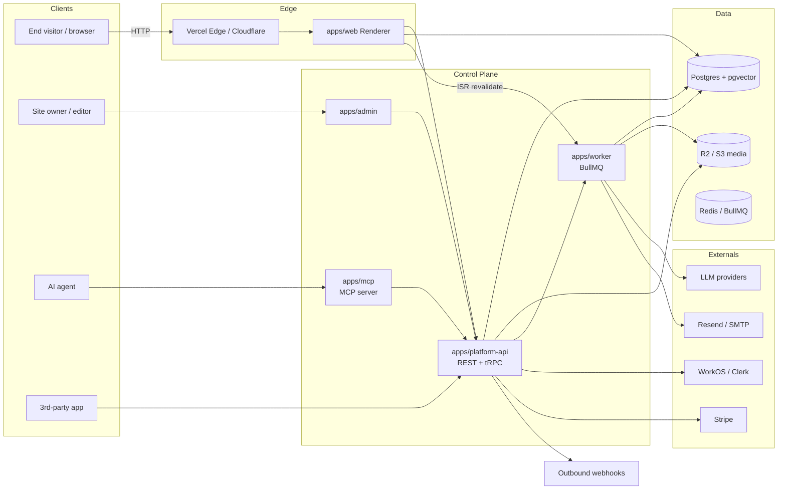

# Agent-Native Website Platform + Agency Layer — 12–18 Month Strategic Roadmap

## Overview

Transform `my-client-websites` (today: a static Turborepo starter with Next.js 15 marketing site + Express API + cron worker) into a best-in-niche **agent-native website platform** with an **agency reseller layer**. Every feature must be reachable through UI, API, and agent tools at parity. Targets agencies/freelancers shipping client sites AND small-business owners self-serving — unified under one multi-tenant platform with a white-label reseller tier.

End state after 12–18 months:

- Multi-tenant SaaS platform for building, hosting, and operating marketing sites
- Agent-native control plane: MCP server + typed agent SDK + webhook fabric, with programmatic parity for every user action
- Visual page builder + headless CMS + media pipeline
- AI layer: site assistant, semantic search, content generation, SEO autopilot, form/lead intelligence
- Agency workspace: white-label, client seat management, template marketplace, reseller billing
- Compliance posture: SOC 2 Type II track, GDPR/CCPA, accessibility baseline, robust observability

## Problem Frame

**Niche:** the intersection of (a) website builders (Webflow, Framer, Wix Studio), (b) headless CMS platforms (Sanity, Contentful, Payload), and (c) agency tooling (Duda, Editor X). Incumbents are either not agent-native, not agency-friendly, or not both.

**Opportunity:** in 2026, customers increasingly build and operate sites **with** AI agents rather than merely with AI features. Competitors retrofit MCP endpoints; a platform designed agent-first from the ground up (parity rule: every UI action = API = MCP tool) wins on:

- Agencies: bulk operations, templated onboarding, client handoff via agents
- Self-serve: "tell the agent what you need" replaces drag-drop for most edits
- Both: verifiable audit trail, reversible changes, deterministic content contracts

**Today's repo** is a single-tenant, hand-customized Next.js starter. Content lives in `apps/web/lib/site-data.ts` as static TypeScript. There is no database, auth, tenancy, billing, or agent surface. Everything below is additive — the current `apps/web` becomes the rendering target (or one of several) fed by the new platform.

## Requirements Trace

- R1. Multi-tenant: one codebase hosts N customer sites, isolated at the data and rendering layer
- R2. Both personas: agencies AND their clients AND direct self-serve users, under one auth/billing model with seat hierarchies
- R3. Agent-native parity: every feature shipped with UI + REST/GraphQL API + MCP tool; no feature that only UI can do
- R4. Great UI/UX: visual editor, live preview, polished design system, mobile-first admin, accessible by default
- R5. Customer feature coverage: CMS, page builder, media, forms, blog, SEO, analytics, A/B, i18n, integrations
- R6. AI differentiators: site chatbot, semantic search, content gen, SEO autopilot, form intelligence
- R7. Agency differentiators: white-label, client workspaces, template marketplace, handoff, reseller billing
- R8. Infra posture: domains, edge rendering, CDN, uptime, backups, observability, compliance (GDPR/SOC 2 track)
- R9. DX: typed SDK, OpenAPI + MCP manifest, CLI, webhooks, sandbox
- R10. Migration-safe: today's `apps/web` and `apps/api` keep working until each piece is replaced

## Scope Boundaries

### In-Scope (12–18 month horizon)

- Platform backend (API, DB, auth, tenancy, billing)
- Visual page builder + headless CMS
- Agent-native control plane (MCP, SDK, webhooks)
- AI differentiators listed in R6
- Agency reseller features listed in R7
- Template marketplace (read-only first; paid authors later)
- One rendering runtime: Next.js 15 renderer targeting Vercel + self-host
- English + 3 additional locales seed (i18n infra is fully general)

### Out of Scope (Non-Goals)

- Mobile app builder / native apps (web only)
- Ecommerce cart/checkout beyond simple Stripe product embeds
- Full-blown CRM (hand off via integrations)
- Building a proprietary visual design tool like Figma — we integrate, not replace
- Support for WordPress/Drupal imports in v1 (later)
- On-prem single-tenant deployments (later, via licensed distribution)

### Deferred to Separate Tasks

- **Native mobile admin apps** — separate initiative post-18 months
- **Private cloud / on-prem offering** — post-SOC 2 completion
- **Developer plugin SDK for 3rd-party extensions** — Phase 7 (post-roadmap)
- **Direct WordPress migration importer** — Phase 7 (post-roadmap)
- **Public partner directory & referral program** — post-launch growth phase

## Context & Research

### Relevant Code and Patterns

- `apps/web/` — Next.js 15 App Router + Tailwind v4 + shadcn-style primitives. Becomes the **rendering runtime** that consumes the new API/CMS, not the authoring UI
- `apps/web/lib/site-data.ts` — static content source. Will be replaced by DB-backed content with the same shape as a migration seam
- `apps/web/components/*` — reusable marketing sections. These become the first generation of **builder blocks**
- `apps/web/components/ui/*` — shadcn primitives. Extract to `packages/ui` when admin app starts consuming them
- `apps/api/src/app.ts` — Express + helmet + cors + zod + rate limit. Blueprint for middleware stack; app expands into a real API gateway
- `apps/cron/src/index.ts` — IndexNow submitter. Pattern for scheduled jobs; expanded into a worker service
- `packages/ui` — empty shell, ready to host shared admin/render components
- `turbo.json` — task graph is minimal. Will grow with `test:e2e`, `migrate`, `generate`, `deploy` targets

### Institutional Learnings

No `docs/solutions/` yet. This roadmap creates the first solutions index.

### External References

- Payload CMS 3.x (Next.js-native CMS) — inspiration for data model + admin UI
- TinaCMS, Sanity Studio — visual editing patterns on Next.js
- Vercel Platforms starter — multi-tenant + custom domain patterns
- MCP spec + Anthropic MCP TypeScript SDK — agent tool interface contract
- Clerk, WorkOS, Stack Auth — multi-tenant auth providers
- Stripe Billing + Tax — metered + seat billing patterns
- Neon / Supabase — Postgres with branching for dev/preview environments
- OpenTelemetry + Grafana Cloud / Datadog — observability
- Playwright + Vitest + Storybook — test pyramid

## Key Technical Decisions

- **Monorepo stays Turborepo + pnpm** — already in place, proven
- **Database: Postgres** (Neon preferred for branching; Supabase acceptable) with **Drizzle ORM** for TypeScript-native schema and migrations. Reason: type-safety + agent tool friendliness (easy to expose schema to agents)
- **Auth: WorkOS or Clerk B2B** — SSO, multi-tenant org model, SCIM — avoids building auth from scratch
- **API style: REST + OpenAPI for external, tRPC for admin-internal, MCP for agents**. Three transports, one service layer underneath (contract-first; services live in `packages/core`)
- **Renderer stays Next.js 15 App Router** on Vercel with Incremental Static Regeneration + on-demand revalidation via webhooks from CMS
- **Admin app is a new `apps/admin` Next.js 15 app** — authoring UI, page builder, CMS studio
- **Job runner: BullMQ on Redis** (Upstash in prod) — replaces and subsumes the node-cron worker
- **Edge: Vercel Edge for auth/middleware; node runtime for API**
- **Storage: S3-compatible (Cloudflare R2 preferred for egress) + Image transform via `@vercel/image` or imgproxy**
- **Search: Postgres `pgvector` + `tsvector` first; graduate to Typesense or Turbopuffer if scale demands**
- **Feature flags: Statsig or OpenFeature + Flipt (self-hosted)** — safe rollout of risky features
- **Billing: Stripe Billing + Stripe Tax + Stripe Connect for agency reseller payouts**
- **Observability: OpenTelemetry everywhere → Grafana Cloud or Datadog**
- **Contract-first: every API endpoint generated from a shared Zod schema; OpenAPI + MCP manifest + TypeScript SDK all derive from the same source**
- **Agent parity rule** (non-negotiable): no feature merges without (1) service function, (2) HTTP endpoint, (3) MCP tool, (4) webhook event where state-changing, (5) audit log entry
- **Testing:** Vitest (unit), Playwright (E2E), pact-style contract tests for API/MCP surface, Storybook + Chromatic for UI regression
- **Design system:** extract `packages/ui` into a real library with tokens, themes, and published Storybook before admin app grows past Phase 1
- **i18n: Next-intl + CMS-driven translations**, RTL-ready from day one
- **Domains: native custom-domain flow via Vercel API or Cloudflare for SaaS**

## Open Questions

### Resolved During Planning

- Monorepo manager: stays pnpm + Turborepo
- Which personas: both agency and direct self-serve, unified platform with reseller tier (user-confirmed)
- Agent surface: internal + external, full parity (user-confirmed)
- Renderer: Next.js 15 (keep existing app)
- Admin surface: separate `apps/admin` Next.js app (reduces coupling with renderer)

### Deferred to Implementation

- Auth vendor: WorkOS vs Clerk B2B — decide during Phase 1 Unit 1.3 after pricing + SCIM coverage check
- DB host: Neon vs Supabase — decide after spike on Drizzle + branching in Phase 1
- Job runner: BullMQ-on-Redis vs Inngest (hosted) — evaluate in Phase 2 (cost + DX tradeoff)
- Rendering host: Vercel Platforms vs Netlify vs self-host on Fly.io — decide alongside custom-domain design in Phase 2
- Editor data model: blocks-as-JSON vs Portable Text vs Lexical tree — Phase 2 spike
- AI model strategy: single-vendor (Anthropic) vs OpenRouter abstraction — Phase 4 decision
- Billing model: per-site vs per-seat vs usage-metered — resolve during Phase 3 pricing research
- Telemetry backend: Grafana Cloud vs Datadog — Phase 5 procurement

## Output Structure

```
my-client-websites/
├── apps/
│   ├── web/                     # renderer (existing, evolves)
│   ├── api/                     # existing Express → becomes legacy/deprecated by end of Phase 2
│   ├── cron/                    # existing → subsumed by apps/worker
│   ├── admin/                   # NEW — Next.js 15 authoring UI
│   ├── platform-api/            # NEW — primary API (REST + tRPC + MCP gateway)
│   ├── worker/                  # NEW — BullMQ workers, replaces apps/cron
│   ├── mcp/                     # NEW — standalone MCP server for external agents
│   └── docs/                    # NEW — Nextra docs site (SDK, API, MCP reference)
├── packages/
│   ├── ui/                      # existing, grows into real design system
│   ├── config/                  # existing
│   ├── eslint-config/           # existing
│   ├── core/                    # NEW — domain services, shared by api/mcp/worker
│   ├── db/                      # NEW — Drizzle schema + migrations + seed
│   ├── schemas/                 # NEW — Zod schemas (source of truth for OpenAPI/MCP/SDK)
│   ├── sdk/                     # NEW — typed TS client + code-connect
│   ├── renderer-blocks/         # NEW — shared page-builder blocks used by apps/web
│   ├── auth/                    # NEW — thin wrapper over WorkOS/Clerk
│   ├── billing/                 # NEW — Stripe wrappers + entitlements
│   ├── ai/                      # NEW — model adapters, prompt library, eval harness
│   ├── search/                  # NEW — pgvector + tsvector helpers
│   ├── flags/                   # NEW — OpenFeature client
│   ├── observability/           # NEW — OTEL bootstrap, logger, error reporter
│   └── test-utils/              # NEW — shared fixtures for vitest + playwright
├── infra/                       # NEW — Terraform/Pulumi IaC, docker-compose, seed scripts
├── docs/
│   ├── plans/
│   ├── brainstorms/
│   ├── solutions/
│   ├── adr/                     # NEW — architecture decision records
│   └── runbooks/                # NEW — on-call runbooks per subsystem
└── .github/workflows/           # CI matrix expands
```

The renderer `apps/web` keeps its current shape; it loses hard-coded `site-data.ts` and consumes the API by end of Phase 2.

## High-Level Technical Design

> _Directional architecture — guidance for review, not implementation specification._



**Service layering (contract-first):**

```
packages/schemas (Zod)  ─────┐
        │                    │
        ▼                    ▼
   OpenAPI + MCP manifest + SDK types (generated)
        │
        ▼
packages/core (domain services: sites, pages, content, media, users, billing, forms, ai)
        │
        ├── apps/platform-api  (HTTP handlers call packages/core)
        ├── apps/mcp           (MCP tool handlers call packages/core)
        ├── apps/worker        (jobs call packages/core)
        └── apps/admin         (tRPC calls thin wrappers over packages/core)
```

**Parity invariant:** for every operation X, three files co-exist:

- `packages/core/sites/X.ts` (service)
- `apps/platform-api/routes/...` exposes X
- `apps/mcp/tools/...` exposes X as tool

CI lints the invariant.

## Implementation Units

Organized into 6 phases. Each phase is ~2–3 months. Units are dependency-ordered within and across phases.

### Phase 0 — Foundation (Month 0–2)

Hardening + scaffolding. Nothing user-visible, but everything after depends on it.

- [ ] **Unit 0.1: Monorepo hardening — CI matrix, conventional commits, release tooling**

**Goal:** every package tested, linted, typechecked in CI; semantic-release pipeline for `packages/*`.
**Requirements:** R10
**Dependencies:** none
**Files:**

- Create: `.github/workflows/ci.yml`, `.github/workflows/release.yml`, `commitlint.config.mjs`, `.changeset/config.json`
- Modify: `turbo.json` (add `test:unit`, `test:e2e`, `typecheck` with remote cache config), `package.json` (add changesets)
  **Approach:** Turbo remote cache (Vercel), matrix CI (Node 20/22), required status checks, changesets for package versioning.
  **Patterns to follow:** Turborepo examples; existing husky config.
  **Test scenarios:**
- Integration: CI runs on PR and blocks merge on fail
- Integration: changeset version bumps packages correctly on release branch
- Happy path: `pnpm turbo run test lint typecheck` succeeds locally and in CI
  **Verification:** green CI on a sample PR touching each app; remote cache hit rate > 0 on second run.

- [ ] **Unit 0.2: Shared TypeScript config and strict mode baseline**

**Goal:** strict TS everywhere; explicit exports; no implicit any across the repo.
**Requirements:** R10
**Dependencies:** 0.1
**Files:**

- Modify: `packages/config/tsconfig.base.json` (new), all `tsconfig.json` files to extend it
  **Approach:** strict + noUncheckedIndexedAccess + exactOptionalPropertyTypes. Fix fallout.
  **Test scenarios:**
- Happy path: `pnpm typecheck` passes across all workspaces
- Edge case: accidental `any` insertion fails typecheck
  **Verification:** `pnpm typecheck` green in CI.

- [ ] **Unit 0.3: Observability baseline (`packages/observability`)**

**Goal:** OTEL SDK + structured logger + error reporter usable across all apps/workers.
**Requirements:** R8
**Dependencies:** 0.2
**Files:**

- Create: `packages/observability/src/{logger,tracer,errors,index}.ts`
- Modify: `apps/api/src/app.ts`, `apps/cron/src/index.ts` (wire bootstrap)
  **Approach:** pino structured JSON, OTEL Node SDK with OTLP exporter, config via env.
  **Test scenarios:**
- Happy path: HTTP request produces trace with correct spans
- Happy path: thrown error produces error log with stack + traceId
- Edge case: missing OTEL endpoint falls back to stdout-only, no throw
  **Verification:** traces visible in Grafana Cloud dev project; Sentry errors grouped by route.

- [ ] **Unit 0.4: Secrets + env schema per app**

**Goal:** every app has a `env.ts` with Zod schema; missing required vars fail fast at boot.
**Requirements:** R8, R10
**Dependencies:** 0.2
**Files:**

- Modify: `apps/api/src/env.ts` (already exists; expand)
- Create: `packages/config/src/env-helpers.ts` (shared helpers)
  **Approach:** parse-once-at-boot pattern. Schema lives next to each app.
  **Test scenarios:**
- Happy path: valid env boots
- Error path: missing required var exits with clear message listing missing keys
- Edge case: dev mode permits more lax validation than prod mode
  **Verification:** `node -e "require('./apps/api/dist/env')"` with missing var exits non-zero with readable message.

- [ ] **Unit 0.5: Seed `packages/db` with Postgres + Drizzle + migrations runner**

**Goal:** Postgres + Drizzle installed, first migration, seed script.
**Requirements:** R1, R8
**Dependencies:** 0.4
**Files:**

- Create: `packages/db/src/{schema,client,migrate,seed}.ts`, `packages/db/drizzle.config.ts`, `packages/db/migrations/0000_init.sql`
- Create: `infra/docker-compose.yml` (local Postgres + Redis)
- Modify: `turbo.json` (`db:migrate`, `db:seed` tasks)
  **Approach:** Drizzle kit for migrations; `pnpm db:migrate` runs them; seed uses factories.
  **Test scenarios:**
- Happy path: fresh DB + migrate + seed succeeds
- Happy path: running migrate twice is idempotent
- Error path: invalid schema change fails migration and rolls back
- Integration: seed creates demo tenant with owner user and sample site
  **Verification:** `pnpm -F db migrate && pnpm -F db seed` succeeds; DB reachable from local API.

- [ ] **Unit 0.6: Contract-first Zod schemas (`packages/schemas`)**

**Goal:** single source of truth for entity shapes; generate OpenAPI + SDK types + MCP manifest in later phases.
**Requirements:** R3, R9
**Dependencies:** 0.5
**Files:**

- Create: `packages/schemas/src/{tenant,user,site,page,block,media,form,content,index}.ts`
  **Approach:** Zod with `.openapi()` annotations via `zod-to-openapi`; export derived types.
  **Test scenarios:**
- Happy path: parse a valid Site payload
- Error path: extra unknown field rejected when schema is strict
- Happy path: Zod → OpenAPI conversion snapshots stable
  **Verification:** snapshot test for generated OpenAPI JSON.

- [ ] **Unit 0.7: Bootstrap `packages/core` service skeleton**

**Goal:** empty-but-typed service interfaces for Sites, Pages, Content, Users, Tenants. No behavior yet.
**Requirements:** R3
**Dependencies:** 0.5, 0.6
**Files:**

- Create: `packages/core/src/{sites,pages,content,users,tenants,index}.ts`
  **Approach:** each service exports typed functions; implementation stubs throw `NotImplemented`.
  **Test expectation:** none — interface scaffolding only; tests land alongside each service in later units.
  **Verification:** typecheck passes; imports resolve from dependent apps.

- [ ] **Unit 0.8: Architecture Decision Records (ADRs) directory**

**Goal:** `docs/adr/` with first five ADRs: monorepo, Drizzle, Next.js renderer, contract-first, parity invariant.
**Requirements:** R10
**Dependencies:** none
**Files:**

- Create: `docs/adr/{0001-monorepo,0002-drizzle,0003-next-renderer,0004-contract-first,0005-parity-invariant}.md`
  **Approach:** MADR template.
  **Test expectation:** none — docs.
  **Verification:** ADR index renders on docs site (later phase); links valid.

### Phase 1 — Multi-Tenancy + Auth + Primary API Shell (Month 2–5)

- [ ] **Unit 1.1: Tenant + user + membership schema**

**Goal:** DB schema for Tenants (orgs), Users, Memberships (role: owner/admin/editor/viewer), ApiKeys, AuditLog.
**Requirements:** R1, R2
**Dependencies:** 0.5, 0.6
**Files:**

- Create: `packages/db/src/schema/{tenants,users,memberships,api_keys,audit_log}.ts`, migrations
- Modify: `packages/schemas/src/{tenant,user,membership}.ts`
  **Approach:** Soft-delete on Tenant; RLS policies for tenant isolation; every row FK-scoped to `tenant_id` except globals.
  **Test scenarios:**
- Happy path: create tenant + owner user + membership in one transaction
- Error path: duplicate tenant slug rejected
- Edge case: removing last owner is prevented
- Integration: RLS blocks cross-tenant read from wrong session role
- Integration: audit log row is written on tenant creation
  **Verification:** psql `SELECT` with `tenant_id` context returns only rows for that tenant.

- [ ] **Unit 1.2: Auth integration (WorkOS or Clerk B2B)**

**Goal:** `packages/auth` provides `authenticate(req)` → `{user, tenant, membership}` across apps; login/logout/signup flows in admin app scaffold.
**Requirements:** R1, R2
**Dependencies:** 1.1
**Files:**

- Create: `packages/auth/src/{provider,session,middleware,index}.ts`
- Create: `apps/admin/app/(auth)/{login,signup,accept-invite}/page.tsx`
  **Approach:** provider adapter pattern so WorkOS/Clerk is swappable. Session = JWT or cookie. Server Actions for mutations.
  **Execution note:** Start with an E2E Playwright test that signs up, creates a tenant, and reaches an authenticated page.
  **Test scenarios:**
- Happy path: email signup → tenant created → dashboard loads
- Happy path: SSO login with mock IdP returns session
- Error path: invalid token rejects with 401 and no tenant leak
- Edge case: expired session triggers silent refresh
- Integration: invite link flow creates membership on accept
  **Verification:** Playwright E2E signup flow green; `/api/me` returns correct user + tenant shape.

- [ ] **Unit 1.3: `apps/platform-api` bootstrap**

**Goal:** new API app replacing `apps/api`. Express → Hono (or Fastify) for faster + edge-ready handlers. Mounts tRPC, REST, health, admin routes. Rate limited, helmet, cors.
**Requirements:** R3, R8
**Dependencies:** 1.2, 0.3
**Files:**

- Create: `apps/platform-api/src/{server,context,middleware,routes,trpc,index}.ts`
- Create: `apps/platform-api/Dockerfile`
  **Approach:** Hono for HTTP; tRPC router for admin UI; OpenAPI served at `/openapi.json`; MCP mounted in Phase 2.
  **Execution note:** Preserve the existing `apps/api` contact + health endpoints behind a feature flag until callers migrate (Unit 1.7).
  **Test scenarios:**
- Happy path: `GET /health` returns ok + env
- Integration: tRPC `whoami` returns authenticated user + tenant
- Error path: unauthenticated admin route returns 401
- Edge case: rate-limit kicks in at 100 req/10min per IP+tenant
- Integration: request trace propagates tenant_id into OTEL spans
  **Verification:** existing `apps/web` contact form still works against legacy route AND new route behind flag.

- [ ] **Unit 1.4: Sites + Pages domain model + CRUD**

**Goal:** create/read/update/delete Sites and Pages scoped to a tenant, with slugs, status (draft/published), and versioning fields.
**Requirements:** R1, R3, R5
**Dependencies:** 1.3
**Files:**

- Create: `packages/core/src/sites/{create,get,list,update,delete,publish}.ts`, same for `pages/`
- Create: API routes + tRPC procedures in `apps/platform-api`
  **Approach:** service + handler split. Publish is explicit; drafts live in `pages.content_draft`.
  **Test scenarios:**
- Happy path: create site, add page, publish
- Edge case: duplicate page slug within site rejected
- Error path: cross-tenant page update returns 403
- Edge case: deleting published page requires confirm flag
- Integration: audit log + webhook event fired on publish
  **Verification:** Playwright: admin user creates site → adds page → published page renders at `/{tenant}/{site}/{slug}`.

- [ ] **Unit 1.5: Custom-domain flow + rendering router**

**Goal:** tenants can bind `www.their-domain.com` to a site; renderer resolves host header → site → page.
**Requirements:** R1, R5, R8
**Dependencies:** 1.4
**Files:**

- Create: `packages/core/src/domains/{bind,verify,release}.ts`
- Modify: `apps/web/middleware.ts` (resolve host → site)
- Modify: `apps/web/app/[...slug]/page.tsx` (replaces hard-coded routes)
  **Approach:** Vercel Platforms API OR Cloudflare for SaaS; verification via TXT or HTTP file; middleware edge cache site→host mapping.
  **Test scenarios:**
- Happy path: bind + verify domain succeeds; site renders at custom host
- Error path: invalid DNS returns actionable error
- Edge case: two tenants cannot bind same domain
- Edge case: unbinding domain falls back to platform subdomain
- Integration: cert issuance handled by provider and status reflected in API
  **Verification:** E2E against staging environment with a real test domain.

- [ ] **Unit 1.6: Generated OpenAPI + SDK package**

**Goal:** build pipeline emits OpenAPI JSON + typed TS SDK (`packages/sdk`) from Zod schemas.
**Requirements:** R3, R9
**Dependencies:** 1.4
**Files:**

- Create: `packages/sdk/src/{client,generated,index}.ts`, `scripts/generate-sdk.ts`
  **Approach:** openapi-ts from the generated OpenAPI; published as private npm via changesets.
  **Test scenarios:**
- Happy path: SDK compiles with end-to-end typed `sdk.sites.create({ name })` call
- Integration: generated client talks to dev API against Pact-style contract test
- Edge case: removing a required field from schema breaks the contract test
  **Verification:** contract test job green in CI.

- [ ] **Unit 1.7: Migrate legacy `apps/api` contact form onto new platform**

**Goal:** old `POST /api/contact` continues to work; code now lives as a Form submission in new platform; `apps/api` becomes thin proxy, slated for removal in Phase 3.
**Requirements:** R10
**Dependencies:** 1.4, 1.6
**Files:**

- Modify: `apps/api/src/app.ts` (proxy to platform-api)
- Create: `packages/core/src/forms/submit.ts`
  **Execution note:** Characterization test first — capture existing `apps/api` behavior, then swap implementation.
  **Test scenarios:**
- Happy path: existing `POST /api/contact` payload still returns 200 with same shape
- Happy path: new form submission appears in admin UI under the tenant's forms
- Error path: validation errors return same error shape for backwards compat
- Edge case: Resend not configured falls back to stdout log as before
  **Verification:** existing `apps/web/components/contact-form.tsx` unchanged; form submissions land in new DB table.

### Phase 2 — Content, Builder, Media, Agent Surface (Month 4–7)

- [ ] **Unit 2.1: Block-based content model**

**Goal:** Pages are a tree of typed Blocks (Hero, Features, CTA, Testimonials, Rich Text, Form, Custom). Schema is versioned.
**Requirements:** R4, R5
**Dependencies:** 1.4
**Files:**

- Create: `packages/schemas/src/blocks/{hero,features,cta,testimonials,richtext,form,custom,index}.ts`
- Create: `packages/renderer-blocks/src/{blocks/*,index}.tsx`
- Modify: `apps/web/app/[...slug]/page.tsx` to render blocks
  **Approach:** block = `{ id, type, props, children? }`. Discriminated union per type. Renderer resolves type→React component. Migrate `apps/web/components/hero-section.tsx` etc. into renderer-blocks.
  **Test scenarios:**
- Happy path: page with Hero + Features + CTA renders identically to current marketing home
- Error path: unknown block type renders fallback + logs warning
- Edge case: nested children blocks render correctly
- Integration: snapshot of rendered HTML matches baseline for Atelier Luna example
  **Verification:** current marketing site rebuilt as block tree seed data; visual diff ≤ 0.1% vs current.

- [ ] **Unit 2.2: Visual page builder in `apps/admin`**

**Goal:** drag-drop builder with live preview. Edit block props via side panel. Undo/redo. Autosave every 2s.
**Requirements:** R4, R5
**Dependencies:** 2.1
**Files:**

- Create: `apps/admin/app/(dashboard)/sites/[siteId]/pages/[pageId]/builder/page.tsx`
- Create: `apps/admin/components/builder/{canvas,inspector,block-palette,history}.tsx`
- Create: `packages/core/src/pages/{autosave,history}.ts`
  **Approach:** dnd-kit for drag-drop; Zustand for local state; optimistic mutation with reconcile. Preview iframe renders `apps/web` in edit-mode.
  **Execution note:** Test-first on the history reducer; E2E Playwright on drag-add-save-reload.
  **Test scenarios:**
- Happy path: add Hero → edit heading → save → reload shows new heading
- Edge case: rapid autosave debounces to 1 write per 2s
- Error path: offline save queues and replays on reconnect
- Integration: undo restores prior state including deleted blocks
- Edge case: two editors on same page see live conflict resolution (last-writer-wins + toast)
  **Verification:** internal dogfood: rebuild marketing home via builder only, no code edits.

- [ ] **Unit 2.3: Media pipeline**

**Goal:** uploads to R2; automatic image variants (webp/avif, responsive widths); CDN-served; alt text + focal point.
**Requirements:** R4, R5, R8
**Dependencies:** 1.3
**Files:**

- Create: `packages/core/src/media/{upload,transform,serve}.ts`
- Create: `apps/admin/components/media/{library,uploader,picker}.tsx`
  **Approach:** presigned R2 PUT; worker transforms + stores variants; serve through `/img/{id}?w=&fm=`.
  **Test scenarios:**
- Happy path: upload 4MB JPEG → 5 variants generated → picker shows thumbnail
- Error path: oversized file rejected with clear message
- Edge case: duplicate upload dedupes via content hash
- Integration: focal point changes propagate to rendered CDN URL query
- Error path: transform failure on corrupt file logs + surfaces error
  **Verification:** Lighthouse perf on marketing page with large hero image ≥ 95 on mobile.

- [ ] **Unit 2.4: Headless CMS collections**

**Goal:** user-defined content types (e.g., "Project", "Team Member") with fields (text, rich text, media, ref, date). Exposed via API + rendered via blocks.
**Requirements:** R5
**Dependencies:** 2.1
**Files:**

- Create: `packages/core/src/content/{collections,entries,fields}.ts`
- Create: `apps/admin/app/(dashboard)/sites/[siteId]/content/*`
  **Approach:** JSON Schema stored in DB; entries as JSONB with validated shape at read/write. Reference fields resolved at render.
  **Test scenarios:**
- Happy path: define Project collection → add entry → render on portfolio page
- Error path: invalid field type rejected on collection save
- Edge case: reference to deleted entry returns tombstone, renderer degrades gracefully
- Integration: updating a collection schema triggers validation of existing entries with actionable warning list
  **Verification:** current static `projects` array in `site-data.ts` migrated into a Projects collection without visual change.

- [ ] **Unit 2.5: Publishing + ISR revalidation**

**Goal:** publishing a page/entry triggers `revalidatePath` on renderer; preview URLs for drafts.
**Requirements:** R4, R5
**Dependencies:** 2.1, 1.5
**Files:**

- Create: `apps/worker/src/jobs/revalidate.ts`
- Modify: `apps/web/app/api/revalidate/route.ts` (new)
  **Approach:** Next.js on-demand revalidation triggered by worker job; signed webhook.
  **Test scenarios:**
- Happy path: publish page → production URL updates within 5s
- Happy path: preview URL with token renders draft for authorized user only
- Error path: revalidation failure is retried 3× with exponential backoff
- Edge case: concurrent publishes queue and apply in order
  **Verification:** end-to-end: change hero heading in builder → published URL reflects change in < 10s.

- [ ] **Unit 2.6: `apps/worker` — BullMQ job runner, subsumes `apps/cron`**

**Goal:** unified worker for IndexNow, revalidation, media transforms, AI jobs, email.
**Requirements:** R8
**Dependencies:** 1.3, 2.3, 2.5
**Files:**

- Create: `apps/worker/src/{server,queues,jobs/*,index}.ts`
- Modify/Delete: deprecate `apps/cron/` (keep until Phase 3 rollout, then remove)
  **Approach:** BullMQ on Upstash Redis; BullBoard dashboard gated behind admin-only route.
  **Test scenarios:**
- Happy path: enqueue revalidate job → executes → logs
- Error path: transient failure retries 3×
- Error path: permanent failure goes to DLQ
- Edge case: idempotent job (by jobId) dedupes
- Integration: IndexNow job preserves hash-based dedupe from current cron impl
  **Verification:** current cron behavior fully replicated; dashboard shows live jobs.

- [ ] **Unit 2.7: `apps/mcp` server + parity for Phase 1–2 operations**

**Goal:** MCP server exposing tools for every operation shipped so far: `create_tenant`, `list_sites`, `create_site`, `create_page`, `update_page_content`, `publish_page`, `upload_media`, `submit_form`.
**Requirements:** R3
**Dependencies:** 1.6, 2.1, 2.3, 2.4, 2.5
**Files:**

- Create: `apps/mcp/src/{server,tools/*,auth,index.ts}`
- Create: `packages/schemas/src/mcp/manifest.ts`
- Create: `scripts/verify-parity.ts` (CI lint)
  **Approach:** Anthropic MCP TypeScript SDK. Each tool wraps a `packages/core` service. OAuth device flow for agent auth; API keys for machine-to-machine.
  **Execution note:** Begin with the parity lint script; CI fails if a core service lacks a matching MCP tool.
  **Test scenarios:**
- Happy path: agent calls `create_site` → site exists in DB → appears in admin UI
- Error path: unauthenticated tool call returns MCP error with `unauthorized` code
- Edge case: tool with invalid params returns structured validation error agent can correct
- Integration: `update_page_content` triggers the same audit log + webhook as UI edit
- Error path: rate limit per agent session enforced and reported via tool response
- Integration: parity lint passes — every core service has a matching tool
  **Verification:** using Claude Desktop or an agent harness, an agent can build a demo site end-to-end with no UI clicks.

- [ ] **Unit 2.8: Webhooks fabric**

**Goal:** tenants subscribe to events (`page.published`, `form.submitted`, `content.updated`, etc.). Signed deliveries, retries, replay.
**Requirements:** R3, R9
**Dependencies:** 2.6
**Files:**

- Create: `packages/core/src/webhooks/{subscriptions,deliver,sign}.ts`
- Create: `apps/worker/src/jobs/webhook-deliver.ts`
- Create: `apps/admin/app/(dashboard)/settings/webhooks/*`
  **Approach:** per-subscription HMAC secret; exponential backoff; replay UI; event log retained 30 days.
  **Test scenarios:**
- Happy path: event delivered to registered URL with valid signature
- Error path: 5xx response retries with backoff, stops after 6 attempts
- Edge case: subscription filter by event type only delivers matching events
- Integration: delivery log visible in admin and queryable via API + MCP
- Edge case: replay from 2 days ago redelivers events preserving original timestamps
  **Verification:** internal smoke: subscribe to `page.published`, publish page, verify delivery with correct signature.

### Phase 3 — Billing, Forms, Analytics, Legacy Removal (Month 6–9)

- [ ] **Unit 3.1: Billing + entitlements (`packages/billing`)**

**Goal:** Stripe Billing integration; plans (Starter/Pro/Agency); usage metering (sites, seats, form submissions, AI tokens); entitlement checks at the service layer.
**Requirements:** R2, R7
**Dependencies:** 1.4
**Files:**

- Create: `packages/billing/src/{stripe,plans,entitlements,usage,index}.ts`
- Create: `packages/core/src/billing/checks.ts`
- Create: `apps/admin/app/(dashboard)/settings/billing/*`
  **Approach:** plans + prices in Stripe; entitlement cache in Redis keyed by tenant. Overage emits usage record to Stripe.
  **Test scenarios:**
- Happy path: upgrade flow moves tenant from Starter to Pro; entitlements reflect change within 30s
- Error path: exceeding seat limit blocks new member invite with upgrade CTA
- Edge case: downgrade triggers archive (not delete) of sites over new limit
- Integration: Stripe webhook updates subscription state; retried on failure
- Edge case: past_due state gates writes but not reads
- Integration: usage meter increments correctly on form submission and AI token consumption
  **Verification:** Stripe test mode: upgrade, downgrade, dunning flows all observable in admin.

- [ ] **Unit 3.2: Forms + lead intelligence**

**Goal:** user-defined forms attached to pages; spam protection; webhook/email delivery; admin inbox.
**Requirements:** R5, R6
**Dependencies:** 2.1, 2.8
**Files:**

- Create: `packages/core/src/forms/{schema,submit,spam,deliver}.ts`
- Create: `apps/admin/app/(dashboard)/sites/[siteId]/forms/*`
  **Approach:** schema per form; hCaptcha or Turnstile; Resend + webhook delivery; basic AI-scored lead quality field (Phase 4 enhances it).
  **Test scenarios:**
- Happy path: submit form → appears in inbox + email + webhook
- Error path: bot traffic blocked by captcha score < threshold
- Edge case: duplicate submission within 60s from same email is deduped but not lost
- Integration: attaching a form to a block works via builder
  **Verification:** Replace legacy `apps/api/contact` with platform form; remove proxy.

- [ ] **Unit 3.3: Analytics + A/B testing**

**Goal:** first-party analytics (pageviews, events); funnel view; A/B experiments on block variants.
**Requirements:** R5, R6
**Dependencies:** 2.5
**Files:**

- Create: `packages/core/src/analytics/{ingest,report,experiments}.ts`
- Create: `apps/admin/app/(dashboard)/sites/[siteId]/analytics/*`
- Modify: `apps/web` to send first-party events
  **Approach:** PostHog or Plausible-compatible ingest endpoint for raw events; nightly roll-ups in Postgres. Experiments hash-bucket visitors by site + experiment ID.
  **Test scenarios:**
- Happy path: pageview event stored and visible in dashboard within 60s
- Edge case: Do-Not-Track header honored — event dropped
- Integration: A/B variant A vs B shown 50/50 for new visitors; sticky per session
- Error path: invalid event payload rejected and counted as error
- Edge case: GDPR-sensitive field (IP) truncated at ingest
  **Verification:** run an A/B on hero heading; see conversion rate by variant over 48 hours.

- [ ] **Unit 3.4: Blog engine + MDX migration**

**Goal:** current MDX blog moves into CMS; authors edit in rich text; `/blog`, `/blog/[slug]` render from DB.
**Requirements:** R5
**Dependencies:** 2.4
**Files:**

- Modify: `apps/web/app/blog/*`
- Create: `packages/core/src/blog/{post,category,tag}.ts`, collection seed importer
- Delete: `apps/web/content/posts/*` once import succeeds (keep backup)
  **Approach:** one-shot importer reads existing MDX files, writes to Posts collection.
  **Test scenarios:**
- Happy path: all current MDX posts visible at same URLs
- Edge case: custom frontmatter fields preserved
- Integration: editing post in admin triggers revalidation
- Error path: unmigrated post redirect to 404 with Sentry event
  **Verification:** production build diff: no broken routes, RSS feed stable.

- [ ] **Unit 3.5: Sunset legacy `apps/api` and `apps/cron`**

**Goal:** remove legacy services once platform owns all behavior.
**Requirements:** R10
**Dependencies:** 1.7, 2.6, 3.2
**Files:**

- Delete: `apps/api/`, `apps/cron/`
- Modify: `README.md`, `turbo.json`, `pnpm-workspace.yaml`, deployment docs
  **Approach:** deprecation window with logged usage; flip traffic; after N days, delete. Include DNS/deployment cleanup.
  **Execution note:** Capture usage metrics for 30 days before deletion; do not delete if non-zero traffic.
  **Test scenarios:**
- Happy path: zero traffic to legacy endpoints for 30 days before removal
- Integration: all existing form submissions still delivered via platform
- Error path: removal PR rejected by check if traffic observed in last 7 days
  **Verification:** CI green, prod traffic reports only platform-api.

- [ ] **Unit 3.6: Onboarding + empty states**

**Goal:** new tenant onboarding: pick template → customize brand → connect domain → publish, in ≤ 5 minutes.
**Requirements:** R2, R4
**Dependencies:** 2.2, 1.5, 3.1
**Files:**

- Create: `apps/admin/app/(onboarding)/*`
- Create: `packages/core/src/onboarding/{progress,checklist}.ts`
  **Approach:** checklist-driven wizard; skipping allowed but resumable.
  **Test scenarios:**
- Happy path: new signup completes wizard and publishes first site
- Edge case: user skips steps and dashboard shows resume CTA
- Integration: each step emits analytics event for funnel measurement
- Error path: domain step failure offers skip-and-retry-later option
  **Verification:** time-to-publish metric for new tenants < 5 min p50 in staging dogfood.

### Phase 4 — AI Differentiators (Month 8–11)

- [ ] **Unit 4.1: `packages/ai` model adapter layer**

**Goal:** unified interface across Anthropic / OpenAI / local; prompt library; eval harness; token cost tracking per tenant.
**Requirements:** R6
**Dependencies:** 3.1
**Files:**

- Create: `packages/ai/src/{adapters/*,prompts,eval,usage,index}.ts`
  **Approach:** thin adapter; structured prompt templates with Zod-typed outputs; evals snapshot regression test golden set.
  **Test scenarios:**
- Happy path: adapter returns typed response for each provider
- Error path: provider timeout falls back to next provider per policy
- Edge case: usage metering increments tenant AI token counter
- Integration: eval harness passes baseline on golden set
- Error path: cost cap exceeded returns `quota_exhausted` with upgrade CTA
  **Verification:** eval baseline job on CI passes for content-generation prompts.

- [ ] **Unit 4.2: AI site assistant (in-admin copilot)**

**Goal:** chat assistant inside admin UI with scoped tools (create page, update hero, generate blog post draft, fix SEO).
**Requirements:** R6, R3
**Dependencies:** 4.1, 2.7
**Files:**

- Create: `apps/admin/app/(dashboard)/sites/[siteId]/assistant/*`
- Create: `packages/ai/src/agents/site-copilot.ts`
  **Approach:** agent loop reusing MCP tools from `apps/mcp` with tenant-scoped auth. Tool-use transcript visible to user with approve/reject for destructive ops.
  **Test scenarios:**
- Happy path: "change hero heading to X" → preview diff → approve → live
- Error path: ambiguous command prompts clarifying question
- Edge case: destructive op (delete page) requires explicit user confirm
- Integration: same actions attributed to the agent in audit log with `actor=copilot, user=<email>`
- Error path: tool failure surfaces to user with retry option
  **Verification:** user study (internal): 10 tasks complete by copilot-only in < 30 min total.

- [ ] **Unit 4.3: Visitor-facing AI chatbot widget**

**Goal:** embeddable chatbot grounded in the site's content; captures leads.
**Requirements:** R6
**Dependencies:** 4.1, 4.5 (search)
**Files:**

- Create: `packages/renderer-blocks/src/blocks/chatbot.tsx`
- Create: `packages/core/src/ai/chatbot/{session,rag}.ts`
  **Approach:** RAG over site content via pgvector; session stored; optional lead-capture after N turns.
  **Test scenarios:**
- Happy path: visitor asks about a service → grounded answer cites source page
- Edge case: out-of-scope question replies with fallback + CTA
- Error path: model failure degrades to form with apology copy
- Integration: captured leads land in forms inbox
- Edge case: rate limit per visitor session
  **Verification:** on demo site, 20 scripted questions answered with ≥ 80% grounded citations.

- [ ] **Unit 4.4: AI content generation (blog posts, section copy, alt text)**

**Goal:** one-click generate draft blog post, section copy, or alt text; always draft state, always human-approved.
**Requirements:** R6
**Dependencies:** 4.1, 2.4
**Files:**

- Create: `packages/ai/src/generators/{blog,section,alt}.ts`
- Modify: builder inspector gains "generate with AI" affordance
  **Test scenarios:**
- Happy path: generate blog post from title + outline → draft created
- Edge case: regenerate preserves human edits merged with AI changes (diff view)
- Error path: offensive/blocked content filtered with explanation
- Integration: token usage metered against tenant plan
  **Verification:** internal: 5 blog drafts generated, reviewed, published with ≤ 20% edit distance.

- [ ] **Unit 4.5: Semantic search + on-site search block**

**Goal:** `pgvector`-powered search; search block for visitor-facing sites; admin search across all content.
**Requirements:** R5, R6
**Dependencies:** 4.1, 2.4, 3.4
**Files:**

- Create: `packages/search/src/{index,query,vector,hybrid}.ts`
- Create: `packages/renderer-blocks/src/blocks/search.tsx`
- Create: `apps/worker/src/jobs/reindex.ts`
  **Approach:** hybrid: tsvector + pgvector + reciprocal rank fusion; reindex on publish.
  **Test scenarios:**
- Happy path: query returns relevant pages with snippet + score
- Edge case: typo tolerance returns right result via vector recall
- Error path: empty query handled gracefully
- Integration: reindex job triggered on publish; stale index < 60s
- Edge case: admin search scoped to tenant only
  **Verification:** blind eval on 50 queries across demo corpus, NDCG@5 ≥ 0.75.

- [ ] **Unit 4.6: SEO autopilot**

**Goal:** automated SEO audits (meta, headings, schema, broken links, speed), AI-suggested fixes, one-click apply.
**Requirements:** R6
**Dependencies:** 4.1, 2.5
**Files:**

- Create: `packages/core/src/seo/{audit,suggest,apply}.ts`
- Create: `apps/admin/app/(dashboard)/sites/[siteId]/seo/*`
  **Approach:** scheduled worker job; Lighthouse CI + custom rules; suggestions as reviewable diffs.
  **Test scenarios:**
- Happy path: audit finds missing alt text on 3 images, AI suggests alt text, user applies
- Edge case: suggestion that would break design flagged and rejected
- Integration: audit history visible in admin
- Error path: Lighthouse crash gracefully marks audit as partial
  **Verification:** before/after Lighthouse score on demo site improves ≥ 8 points after autopilot apply.

### Phase 5 — Agency Layer + Polish (Month 10–14)

- [ ] **Unit 5.1: Agency workspaces + client seats**

**Goal:** Agency tenant hosts multiple Client sub-tenants. Agency staff have unified dashboard across clients. Client users see only their own site.
**Requirements:** R2, R7
**Dependencies:** 1.1, 3.1
**Files:**

- Modify: `packages/db/src/schema/tenants.ts` (parent_tenant_id)
- Create: `packages/core/src/agency/{workspace,client,invite}.ts`
- Create: `apps/admin/app/(dashboard)/agency/*`
  **Approach:** parent–child tenant; agency plan unlocks creating N client tenants. Permissions model inherits unless explicitly restricted.
  **Test scenarios:**
- Happy path: agency owner creates client tenant + invites client
- Edge case: client user can't see sibling client's sites
- Error path: client tenant cannot create sub-tenants
- Integration: billing rolls up to agency by default, toggle to direct-bill client
- Edge case: removing agency doesn't orphan client data — requires migration flow
  **Verification:** internal: agency user manages 3 client tenants; each client sees only own dashboard.

- [ ] **Unit 5.2: White-label branding**

**Goal:** agency can set logo, colors, custom domain, and email sender for the admin UI their clients see.
**Requirements:** R4, R7
**Dependencies:** 5.1
**Files:**

- Create: `packages/core/src/whitelabel/{theme,domain,email}.ts`
- Modify: `apps/admin` layout to consume theme from context
  **Test scenarios:**
- Happy path: agency sets logo → client sees agency logo on login
- Edge case: default fallback when agency has no white-label configured
- Integration: transactional email sends from agency's domain (via verified SPF/DKIM)
- Error path: unverified email domain prevents email white-labeling
  **Verification:** demo agency: client login page, dashboard header, emails all agency-branded.

- [ ] **Unit 5.3: Template marketplace (v1 — first-party only)**

**Goal:** browsable templates; clone-to-site flow; starter industries (legal, wellness, fitness, consulting).
**Requirements:** R7, R4
**Dependencies:** 2.1, 2.4
**Files:**

- Create: `packages/core/src/templates/{catalog,clone}.ts`
- Create: `apps/admin/app/(dashboard)/templates/*`
- Create: `seeds/templates/{legal,wellness,fitness,consulting}/*`
  **Approach:** template = serialized Site + Pages + Blocks + Content entries + default media refs. Clone creates new site + duplicates assets.
  **Test scenarios:**
- Happy path: clone Legal template → new site ready with all pages and default copy
- Edge case: template with missing dependency (e.g., AI chatbot without AI plan) prompts upgrade
- Integration: cloned site revalidates cleanly and renders without errors
  **Verification:** 4 templates live; internal dogfood clones each successfully.

- [ ] **Unit 5.4: Reseller billing (Stripe Connect)**

**Goal:** agencies can mark up and bill clients directly; platform takes commission; payouts via Stripe Connect.
**Requirements:** R7
**Dependencies:** 3.1, 5.1
**Files:**

- Modify: `packages/billing/src/{stripe,plans}.ts`
- Create: `packages/billing/src/reseller/{connect,markup,payout}.ts`
- Create: `apps/admin/app/(dashboard)/agency/billing/*`
  **Approach:** Connected accounts for agencies; application fees for platform commission; direct charges with platform-fee model.
  **Test scenarios:**
- Happy path: agency sets 20% markup on Pro plan → client pays marked-up price → agency gets payout minus platform fee
- Error path: Connect onboarding incomplete blocks reseller billing with clear CTA
- Edge case: refund path splits correctly between platform, agency, and client
- Integration: tax (Stripe Tax) applied to client's jurisdiction
- Edge case: past-due on client gates only their site; agency's other clients unaffected
  **Verification:** Stripe test-mode end-to-end with 2 client tenants, verifying accounting in Stripe dashboard.

- [ ] **Unit 5.5: i18n (interface + content)**

**Goal:** admin UI translated to EN/ES/FR/DE; content i18n so a site can have multiple locales with language switcher.
**Requirements:** R5
**Dependencies:** 2.4
**Files:**

- Create: `apps/admin/messages/{en,es,fr,de}.json`
- Modify: `packages/schemas/src/page.ts` (locale-aware)
- Create: `packages/core/src/i18n/{locale,translation}.ts`
  **Approach:** next-intl; locale-scoped content entries; URL routing with locale prefix or subpath.
  **Test scenarios:**
- Happy path: admin UI switches locales with persisted preference
- Happy path: site with EN + ES loads correct content from URL
- Edge case: missing translation falls back to default locale with warning in admin
- Integration: RTL locale (seed test with Arabic dev stub) flips layout correctly
  **Verification:** Crowdin or Lokalise integration live; translation coverage ≥ 98% for admin UI strings.

- [ ] **Unit 5.6: Accessibility baseline (WCAG 2.2 AA)**

**Goal:** axe-core clean on admin + renderer; keyboard navigable builder; screen-reader friendly.
**Requirements:** R4
**Dependencies:** 2.2
**Files:**

- Modify: all admin components with keyboard + aria coverage
- Create: `packages/test-utils/src/a11y.ts`
- Modify: `.github/workflows/ci.yml` (axe CI job)
  **Approach:** axe CI gate; Storybook a11y addon; published A11y Statement per-site.
  **Test scenarios:**
- Happy path: axe CI zero violations on admin key screens
- Happy path: builder fully keyboard-operable
- Edge case: color contrast checker flags user-set theme violations
- Integration: every marketing block passes axe with default content
  **Verification:** VPAT-style self-assessment committed; third-party a11y audit scheduled.

- [ ] **Unit 5.7: Design system & Storybook for `packages/ui`**

**Goal:** formalize `packages/ui` with tokens, variants, Storybook, visual regression via Chromatic.
**Requirements:** R4
**Dependencies:** 2.2
**Files:**

- Create: `packages/ui/src/{tokens,components/*,storybook}`
- Create: `packages/ui/.storybook/*`
  **Approach:** shadcn-derived + CVA; tokens as CSS vars; Chromatic snapshots block regressions.
  **Test scenarios:**
- Happy path: all components render in Storybook without console errors
- Integration: Chromatic snapshot diff baseline set; PR failing visual diff blocks merge
- Edge case: dark/light mode snapshots both captured
  **Verification:** Storybook deployed at `storybook.domain`; Chromatic integrated with PRs.

- [ ] **Unit 5.8: Performance pass (Core Web Vitals ≥ "Good" at p75)**

**Goal:** renderer p75 LCP < 2.5s, CLS < 0.1, INP < 200ms; admin TTI < 3s on mid-tier hardware.
**Requirements:** R4, R8
**Dependencies:** 2.5, 2.3
**Files:**

- Modify: renderer + admin for RSC boundaries, bundle splitting, image priority hints
- Create: `infra/perf-budget.json` (perf budget enforced in CI)
  **Approach:** bundle analyzer gate in CI; priority hints; edge caching tuning; worker preload.
  **Test scenarios:**
- Happy path: Lighthouse CI median ≥ 95 perf on demo site
- Edge case: slow 3G throttling still keeps LCP < 4s
- Integration: perf budget PR gate fails if JS payload > budget
  **Verification:** RUM (Vercel Analytics or equivalent) confirms p75 targets over 7 days staging.

### Phase 6 — Ecosystem, Compliance, Docs (Month 13–18)

- [ ] **Unit 6.1: Public docs site (`apps/docs`)**

**Goal:** Nextra docs site with API reference (from OpenAPI), MCP reference (from manifest), SDK reference, guides, and changelog.
**Requirements:** R9
**Dependencies:** 1.6, 2.7
**Files:**

- Create: `apps/docs/**`
- Create: `scripts/generate-reference.ts`
  **Test scenarios:**
- Happy path: OpenAPI and MCP manifests rebuild docs on schema change
- Integration: code samples executed in CI (playground) to prevent rot
- Edge case: search across docs returns correct results
  **Verification:** docs live at `docs.<domain>`; weekly changelog published automatically from changesets.

- [ ] **Unit 6.2: CLI (`npx my-platform`)**

**Goal:** CLI for local dev loops: scaffold template, preview site, push/pull content, manage domains, invoke MCP tools.
**Requirements:** R3, R9
**Dependencies:** 1.6, 2.7
**Files:**

- Create: `packages/cli/**`
  **Approach:** oclif or commander; auth via device code; reuses SDK.
  **Test scenarios:**
- Happy path: `my-platform login` → OAuth device flow → token stored
- Happy path: `my-platform pull content` downloads collection entries to local files
- Error path: auth expiry prompts re-login
- Integration: CLI commands routed through SDK, not hand-rolled HTTP
  **Verification:** golden path: scaffold + edit + push + publish in under 2 minutes from empty dir.

- [ ] **Unit 6.3: Sandbox environment per tenant**

**Goal:** each tenant has a `sandbox` branch of their content for agent experimentation without affecting production. Merge to main promotes changes.
**Requirements:** R3
**Dependencies:** 2.7
**Files:**

- Create: `packages/core/src/environments/{branch,merge,promote}.ts`
  **Approach:** content-level copy-on-write per environment; render-time environment selector.
  **Test scenarios:**
- Happy path: create sandbox, agent edits, merge back → prod updates
- Edge case: conflict between sandbox and main surfaced with diff UI
- Error path: merge with forbidden change (published status on unapproved page) blocked
  **Verification:** agent copilot runs in sandbox by default; user reviews + promotes.

- [ ] **Unit 6.4: Compliance — SOC 2 Type II readiness + GDPR/CCPA tooling**

**Goal:** DPA-ready data export + deletion; audit log export; privacy center per site; SOC 2 control baseline implemented (access review, change management, backups, key mgmt).
**Requirements:** R8
**Dependencies:** 5.1, 3.1
**Files:**

- Create: `packages/core/src/compliance/{export,delete,consent}.ts`
- Create: `apps/admin/app/(dashboard)/settings/{privacy,security}/*`
- Create: `docs/runbooks/*` (incident response, backup/restore, access review)
  **Approach:** Vanta or Drata vendor for evidence collection; annual pen-test; documented controls. DSRs (data subject requests) self-service in admin.
  **Test scenarios:**
- Happy path: DSR export returns downloadable archive within 24h
- Happy path: DSR deletion removes PII within 30 days and anonymizes analytics
- Integration: audit log export to SIEM works
- Edge case: backup restore rehearsal succeeds with RPO ≤ 1h and RTO ≤ 4h
- Integration: access review report generated monthly
  **Verification:** Type II observation window begins; auditor sign-off on control design.

- [ ] **Unit 6.5: Observability v2 — SLOs, dashboards, on-call**

**Goal:** SLOs per surface (API availability 99.9%, publish latency p95 < 5s, form delivery success 99.95%); paging via PagerDuty; runbooks.
**Requirements:** R8
**Dependencies:** 0.3
**Files:**

- Create: `infra/slo/*.yml`, Grafana dashboards
- Create: `docs/runbooks/{api-down,publish-stuck,webhook-delivery-broken}.md`
  **Test scenarios:**
- Integration: injected failure in staging pages on-call within 2 min
- Happy path: dashboards display SLO burn rate per surface
- Edge case: alert flap suppression works
  **Verification:** on-call rotation live; quarterly error-budget review scheduled.

- [ ] **Unit 6.6: Developer platform — OAuth apps + scoped tokens + partner directory (read-only v1)**

**Goal:** third-party apps auth via OAuth with scopes; published directory page on docs.
**Requirements:** R3, R9
**Dependencies:** 6.1, 6.4
**Files:**

- Create: `packages/core/src/oauth/{app,grant,scope}.ts`
- Create: `apps/admin/app/(dashboard)/settings/developers/*`
- Modify: `apps/docs` to render partner directory
  **Test scenarios:**
- Happy path: OAuth authorization code flow with PKCE succeeds
- Error path: invalid scope rejected
- Edge case: revoking token invalidates active sessions
- Integration: scoped token allows read but not write to sites
  **Verification:** external test app integrates successfully end-to-end.

- [ ] **Unit 6.7: GTM readiness — pricing page + status page + billing portal + support**

**Goal:** public marketing pages for the platform itself; status page; customer support surface.
**Requirements:** R7
**Dependencies:** 3.1
**Files:**

- Create: public marketing content under `apps/web` platform section (or `apps/marketing` if separated)
- Integrate: Statuspage.io or Better Stack
- Integrate: Intercom or Plain for support + changelog widget
  **Test scenarios:**
- Happy path: public pricing page renders plans from Stripe
- Integration: status page auto-updates from synthetic checks
- Edge case: support widget deep-links into tenant context for logged-in users
  **Verification:** dogfood: support tickets routed to help inbox; status page reflects incidents.

## System-Wide Impact

- **Interaction graph:** renderer (`apps/web`) ↔ platform-api ↔ admin/mcp/worker; all touch DB + R2 + Redis. Webhooks + ISR revalidation are the primary out-of-band signals. Every state change must dual-emit audit log + webhook.
- **Error propagation:** standardized `AppError` in `packages/core` with `code`, `status`, `cause`; HTTP + MCP + webhook + UI all map to the same taxonomy. Worker retries are typed by retryability class.
- **State lifecycle risks:** draft vs published; sandbox vs main; soft-delete windows for tenant/site/page; billing past-due read-only mode; orphaned media after page delete (GC job). Each needs an owner in the service layer.
- **API surface parity:** CI lint script (Unit 2.7) enforces every core service has HTTP route AND MCP tool AND (where applicable) webhook event AND admin UI surface. Violations block merge.
- **Integration coverage:** builder ↔ revalidation ↔ renderer is the highest-integration path; Playwright E2E is non-negotiable. Billing ↔ entitlements ↔ service checks is the second.
- **Unchanged invariants:** current marketing site URL structure preserved through migration (no customer-visible 404s). Blog RSS feed URL stable. Contact form payload shape backwards compatible during deprecation window.

## Risks & Dependencies

| Risk                                       | Likelihood | Impact   | Mitigation                                                                                                                |
| ------------------------------------------ | ---------- | -------- | ------------------------------------------------------------------------------------------------------------------------- |
| Scope creep in "all customer features"     | High       | High     | Phased delivery with hard exit criteria per phase; feature requests off-plan land in `docs/brainstorms/` for later cycles |
| Agent-parity rule slows team               | Med        | Med      | Codegen from schemas (Unit 1.6) + CI lint (Unit 2.7) reduce cost to near-zero per feature                                 |
| Multi-tenant data leak                     | Low        | Critical | RLS + integration tests + quarterly pen-test; tenant scoping is baked into the ORM layer, not left to handlers            |
| Billing edge cases (dunning, tax, refunds) | Med        | High     | Use Stripe Billing + Tax + Connect as designed; do not build custom billing math                                          |
| AI model cost unbounded                    | Med        | High     | Per-tenant token caps + plan gating + hard spend alerts; evals prevent silent prompt regressions                          |
| Legacy `apps/api` + `apps/cron` drift      | Med        | Med      | Deprecation window with usage metrics gates removal (Unit 3.5)                                                            |
| Custom-domain TLS / DNS complexity         | Med        | Med      | Use Vercel Platforms or Cloudflare for SaaS primitives; do not hand-roll ACME                                             |
| Compliance cost + time                     | Med        | High     | Start evidence collection at Phase 0 (observability + audit log); use Vanta-style vendor                                  |
| Vendor lock-in (auth, billing, AI)         | Med        | Med      | Adapter layers in `packages/{auth,billing,ai}`; swap possible with 1–2 weeks of work                                      |
| Org scale / hiring                         | High       | High     | Roadmap assumes 4–8 engineers by Phase 3. Reprioritize to P0 + P1 + P4 AI subset if team stays smaller                    |

## Phased Delivery

- **Phase 0 (months 0–2):** foundation. No user-visible changes. Ship gate: green CI, DB running, observability working, ADRs published.
- **Phase 1 (months 2–5):** platform-api + multi-tenant + auth + site/page CRUD + custom domains. Ship gate: internal team can create a tenant, add a page, bind a domain.
- **Phase 2 (months 4–7):** builder + media + CMS + worker + MCP + webhooks. Ship gate: marketing home rebuilt by the builder only; agent builds a demo site end-to-end.
- **Phase 3 (months 6–9):** billing + forms + analytics + blog migration + legacy sunset + onboarding. Ship gate: paying customers can self-serve.
- **Phase 4 (months 8–11):** AI copilot + chatbot + content gen + search + SEO autopilot. Ship gate: AI features reliably used weekly by design partners without escalation.
- **Phase 5 (months 10–14):** agency workspaces + white-label + templates + reseller billing + i18n + a11y + perf + design system. Ship gate: first paying agency onboards 10+ clients.
- **Phase 6 (months 13–18):** docs + CLI + sandbox + SOC 2 Type II + SLOs + developer platform + GTM. Ship gate: external partner apps shipping; SOC 2 report in hand.

Phases overlap intentionally to enable parallel workstreams (builder + billing + AI are separable tracks once Phase 1 is done).

## Documentation Plan

- ADRs in `docs/adr/` — one per significant decision
- Runbooks in `docs/runbooks/` — one per incident class
- Reference docs (API, MCP, SDK) auto-generated, deployed at `docs.<domain>`
- Changelog via changesets, published with each release
- Migration guide for customers moving from starter template to platform (Phase 2)

## Operational / Rollout Notes

- **Feature flags (Flipt / OpenFeature) from Phase 0.** Every new user-facing feature ships dark, flips per tenant, then by plan.
- **Canary deploys** on the platform-api via Vercel preview + gradual traffic shift.
- **Data migrations** include forward + backward scripts; every migration peer-reviewed.
- **Backups:** point-in-time recovery on Postgres; weekly restore rehearsal (Unit 6.4).
- **Incident response:** PagerDuty rotation starts Phase 5; pre-rotation, single on-call founder/lead.
- **Security disclosure** page + `security.txt` in Phase 1.

## Success Metrics

- **Phase 2 gate:** internal dogfood replaces current starter's static content with platform-rendered content; visual diff < 0.5%
- **Phase 3 gate:** first 10 paying tenants; NPS ≥ 40; churn < 5% monthly
- **Phase 4 gate:** ≥ 50% of tenants use at least one AI feature weekly; agent-built sites ≥ 15% of new sites
- **Phase 5 gate:** ≥ 3 paying agencies with ≥ 10 clients each; reseller GMV > $10k/mo
- **Phase 6 gate:** SOC 2 Type II issued; ≥ 5 external integrations live; docs DAU > 200

## Sources & References

- ADRs (to be created in Unit 0.8): `docs/adr/`
- Existing repo: `README.md`, `apps/web/`, `apps/api/src/app.ts`, `apps/cron/src/index.ts`, `apps/web/lib/site-data.ts`
- External: Payload CMS 3.x docs; Vercel Platforms starter; Anthropic MCP spec; WorkOS B2B docs; Stripe Billing + Connect docs; Neon + Drizzle docs; OpenTelemetry Node docs
- Related future artifacts: `docs/brainstorms/` (per-feature deep dives spawned from this roadmap), individual `docs/plans/` files per phase once that phase starts detailed execution
